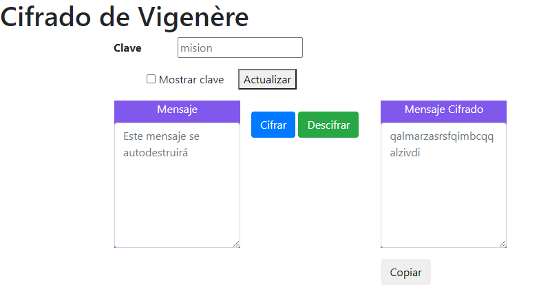
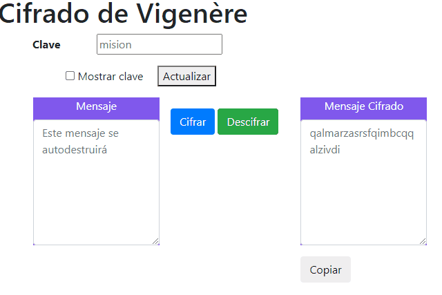

# **El Cifrado de Vigenère**
<a href="./vigenere-site/index.html" target="_blank"><strong>Ir al cifrador</strong></a>

## **Introducción**

El cifrado de Vigenére, también conocido durante un tiempo como *El cifrado indescifrable*, se basa en el funcionamiento del *cifrado César* y la aritmética modular para encriptar mensajes de una forma simple a la vez que robusta. 

La clave está constituida por una secuencia de símbolos del alfabeto K = {k0, k1, ... ,kd-1}, de longitud d, y que emplea la siguiente transformación congruente lineal de cifrado:
```
Ek (mi) = mi + k (i mod d) (mod n)
```


siendo mi el i-ésimo símbolo del texto claro y n el cardinal (longitud) del alfabeto de entrada

Es polialfabético, por lo que la sustitución aplicada a cada caracter varía en función de la posición que ocupe este dentro del texto claro.  

Esta implementación utiliza el alfabeto inglés estándar: de la 'a' a la 'z'.

```
a, b, c, d, e, f, g, h, i, j, k, l, m, n, o , q, r, s, t, u, v, w, x, y, z
```

## **Instrucciones**
Haga click en<a href="./vigenere-site/index.html" target="_blank"><strong>VigenereCipher</strong></a> para ir al cifrador. 



- Todos los mensajes se transforman a minúsculas antes de ser procesados
- Todos los acentos se eliminan, por ejemplo: `à` se transforma en `a`
- Los espacios, saltos de línea, signos de puntuación o signos no pertenecientes al alfabeto son ignorados.
- **Clave**: Por defecto es mision. Para cambiarla modifique el campo correspondiente y presione el botón `Actualizar`
- **Cifrar un mensaje:** Redacte el mensaje a cifrar en el campo `Mensaje` y presione el botón `Cifrar` para que aparezca el mensaje cifrado en el campo `Mensaje Cifrado`. Para copiar el mensaje cifrado al portapapeles presione el botón `Copiar`
- **Descifrar un mensaje:** Redacte el mensaje cifrado en el cmapo `Mensaje Cifrado` y presione el botón `Descifrar` para que apareza el mensaje descifrado en el campo `Mensaje`.

